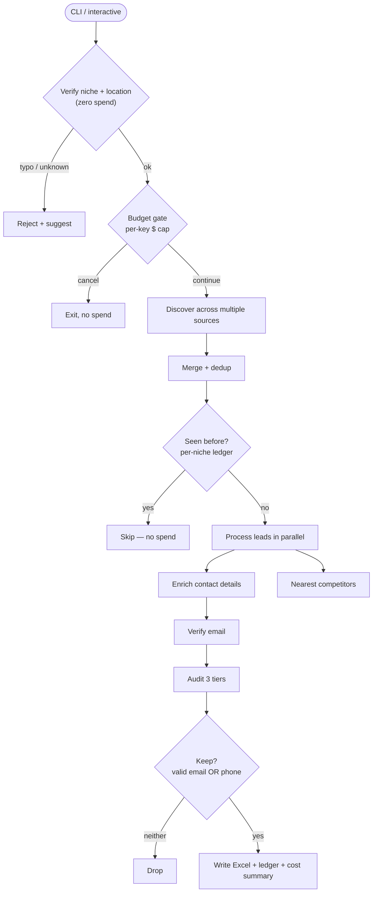

<div align="center">

# 🎯 Prospector — Lead-Generating Pipeline

### A production-grade B2B lead-discovery & marketing-audit engine

Turns a niche + city into a list of **contactable, qualified prospects** — each with a verified contact, named competitors, and three **fact-checked** talking points for outreach. Concurrent, API-cost-capped, resumable, and built to never fabricate a single field.


</div>

> ### 📌 About this repository
> This is a **portfolio case study** of a production system I designed and built for a UK
> home-services performance-marketing agency. It documents the **architecture, engineering
> decisions, and results**, and includes a **runnable, tested subset** of the codebase — the
> infrastructure layer (cost control, dedup, reliability). The proprietary core (discovery,
> enrichment, and audit logic) is **kept private**. Everything here is real; sample contact
> data is masked.

---

## The problem

A performance-marketing agency lives or dies by its pipeline of qualified prospects. Doing
this by hand — find a business, identify the owner, get a real email, research their
marketing gaps, check their competitors — takes ~15–20 minutes **per lead** and doesn't
scale. I built a system that does it in **seconds per lead**, at volume, without ever
inventing data that would embarrass the sender on a call.

## What it does

For a given niche and location (e.g. *roofing in Leeds*) the pipeline:

1. **Discovers** businesses across multiple sources and de-duplicates them.
2. **Identifies the decision-maker** and derives + **verifies** their work email and phone.
3. **Audits each website** into three problem tiers — `technical`, `competitive`, `opportunity` — using only verifiable facts.
4. **Names the 3 nearest competitors** and benchmarks the business against them.
5. **Exports a send-ready Excel** — one row per qualified, contactable prospect.

All under a hard API-spend cap, with a memory of everything already processed so it never
pays twice.

## 🗺️ How it works



Full module map → **[docs/ARCHITECTURE.md](docs/ARCHITECTURE.md)**.

## 🛠️ Engineering highlights

- **Correctness first — "blank beats wrong."** Every field is a verifiable fact; nothing is guessed or invented.
- **Hard cost governance.** Spend tracked per API key per month, with a graceful stop before a configurable cap — an unattended run can't run up an unbounded bill.
- **Idempotent & resumable.** A per-niche dedup ledger means re-runs *extend* coverage instead of re-paying; checkpoints resume a crashed run.
- **Reliability layer.** Exponential-backoff retries on transient errors so one network hiccup never loses a lead.
- **Concurrency done right.** I/O-bound work on a thread pool, sized to the slowest upstream **rate limit** rather than the CPU — ~**25× faster** than the original sequential pipeline.
- **Real-world output.** Excel with phone columns as text (no scientific-notation corruption) and collision-safe filenames (never overwrites a prior run).
- **Tested without the network.** External calls are injected; **139 mocked tests**, pyflakes-clean.

→ The reasoning behind each: **[docs/DESIGN-DECISIONS.md](docs/DESIGN-DECISIONS.md)**.

## 📈 Results

| | |
|---|---|
| Throughput | ~**25×** the original sequential pipeline (~seconds/lead) |
| Cost | self-capped per API key; ≈ pennies per 10 leads |
| Output | 20-column, send-ready Excel; one row per qualified prospect |
| Quality | 3 fact-based, per-lead talking points; competitors named |
| Tests | 139 passing, network fully mocked |

## 📦 What's in this repo

| Included (runnable + tested) | Proprietary (kept private) |
|---|---|
| `cost.py` — per-key budget cap | discovery / multi-source search |
| `ledger.py` — per-niche dedup | contact enrichment + email derivation |
| `reliability.py` — retry + checkpoint | the 3-tier marketing audit |
| `tests/` — 24 tests for the above | niche/location targeting logic |
| Architecture + design docs, masked sample | |

```bash
python -m pip install -r requirements.txt
python -m pytest tests/ -q        # 24 passing — the included infrastructure layer
```

## 📤 Sample output

A real (contact-masked) run is in **[`samples/`](samples/)** — see the full 20-column
schema and the quality of the three problem tiers.

> **Example talking points (one lead):** *97 reviews at 4.9★, not used in any paid ad* ·
> *Nearest rival holds 231 reviews to this firm's 97 — the local leader to overtake* ·
> *No retargeting pixel: paying for traffic it can't follow up.*

## 🧰 Tech

Python 3.10+ · concurrent (thread pool) · REST API integrations (maps/places, a company
registry, an email-verification service) · Excel I/O · pytest (mocked) · pyflakes.

---

## 👤 Author

**Wassay Sarwar** — I build the systems behind growth: ad campaigns, funnels, websites,
and the Python automation underneath. AI-assisted development, shipped end-to-end to
production.

- 💼 LinkedIn: [in/wassay-sarwar](https://www.linkedin.com/in/wassay-sarwar)
- 📧 wassaysarwar@gmail.com

This repository is shared as a work sample; see [LICENSE](LICENSE).
