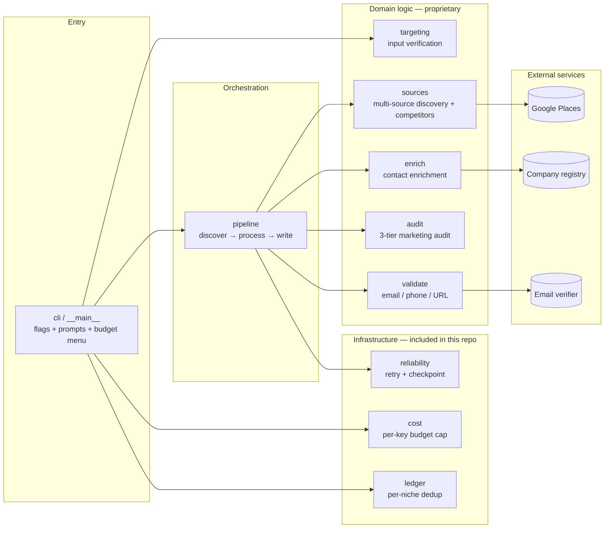
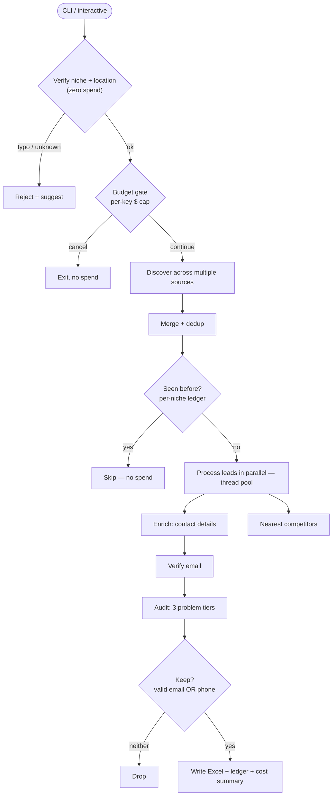

# Architecture

A single-process Python CLI. A thin command layer verifies input and gates
spend; an orchestrator then fans work across a thread pool. Each module owns one
responsibility and talks to exactly one external service.

> This public repo includes the **infrastructure layer** (`cost`, `ledger`,
> `reliability`). The discovery/enrichment/audit modules are proprietary and not
> published — they're shown here only as design.

## Component diagram

## Pipeline flow

## Modules

| Module | Responsibility | In this repo |
|---|---|---|
| `cli` / `__main__` | Flags, interactive prompts, budget menu, dependency wiring | — |
| `targeting` | Verify niche + location **before any spend** | — |
| `sources` | Multi-source discovery + nearest-competitor geometry | — |
| `enrich` | Contact enrichment (website + company registry + work-email derivation) | — |
| `audit` | 3-tier marketing audit (verifiable facts only) | — |
| `validate` | Email verification, phone E.164, URL liveness | — |
| `pipeline` | Orchestration, concurrency, output | — |
| `config` | Keys, output schema, tunables | — |
| **`cost`** | Per-key, per-month spend tracking with a hard graceful stop | ✅ |
| **`ledger`** | Per-niche dedup memory; checked before any paid call | ✅ |
| **`reliability`** | Retry/backoff + within-run checkpoint resume | ✅ |

See **[DESIGN-DECISIONS.md](DESIGN-DECISIONS.md)** for the *why* behind these choices.
